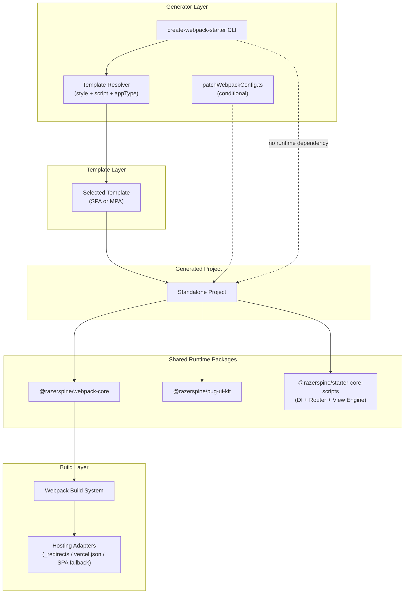

# Architecture

---

## System Architecture Diagram (Mermaid)



---

## Architectural Boundaries

- The CLI is a **generator tool** and is never used at runtime.
- Templates are **copied into the generated project**.
- Shared runtime packages are **published to npm and versioned independently**.
- The generated project is **fully standalone**.
- Runtime architecture lives inside **published packages**, not inside the CLI.

---

## Purpose

This repository is a **monorepo** that hosts:

- a public CLI (`create-webpack-starter`)
- official project templates
- shared runtime packages
- shared build configuration packages

The monorepo exists to ensure:

- consistent development experience
- shared tooling and conventions
- atomic changes across related packages
- synchronized architectural evolution

---

## Core Principles

### Strict Separation of Responsibilities

#### CLI Responsibilities

The CLI handles:

- user interaction (prompts, flags)
- template selection
- file copying
- dependency installation

#### Template Responsibilities

Templates define:

- project structure
- webpack configuration
- dependencies
- application source code

#### Shared Runtime Responsibilities

Shared packages provide reusable runtime logic:

- dependency injection container
- Router
- component lifecycle
- reactive state engine
- DOM binding system

Generated projects have **no runtime dependency on the CLI**.

---

## Runtime Architecture (SPA & MPA)

Runtime behavior is provided by `@razerspine/starter-core-scripts`.

As of **v0.5.x**, the runtime introduces a structured application bootstrap system.

### SPA Runtime Architecture

SPA templates include a lightweight application runtime with:

- Dependency Injection container
- Router with guard support
- BaseComponent lifecycle abstraction
- Proxy-based reactive state
- Automatic DOM bindings

Application bootstrap:

```ts
bootstrapApplication({
  providers: [
    provideRouter(routes)
  ]
});
```

The bootstrap system initializes:

- dependency injection container
- router instance
- runtime services

### SPA Component Model

Pages extend `BaseComponent`.

Example:

```ts
export class HomePage extends BaseComponent<State> {

  protected onInit() {
    console.log('Home mounted');
  }

}
```

Components support lifecycle hooks:

- `onInit()`
- `onDestroy()`

### Router Guards

Routes may include navigation guards:

```text
{
  path: '/dashboard',
    component: DashboardPage,
    canActivate: [authGuard]
}
```

Guard return values:

| Return    | Behavior         |
|-----------|------------------|
| `true`    | allow navigation |
| `false`   | block navigation |
| `string`  | redirect         |
| `Promise` | async resolution |

Guards execute sequentially and may redirect navigation.

### SPA Lifecycle

```text
Route change
  ↓
destroy previous component
  ↓
new Component(container)
  ↓
mount()
  ↓
render()
  ↓
bind events
  ↓
applyBindings()
  ↓
onInit()
```

Memory safety is ensured via:

- automatic cleanup registry
- Proxy disconnect
- delegated event binding

### MPA Runtime Architecture

MPA templates reuse the same reactive engine but **without Router or DI container**.

Available runtime features:

- `createStore()`
- `applyBindings()`
- `bindClickEvents()`
- `bindForms()`

Example initialization:

```ts
const { state } = createStore(initialState, () => update());
applyBindings(document.body, state);
```

MPA pages are independent entry points and do not share navigation state.

---

## Application Types (SPA vs MPA)

Templates represent different architectural modes.

### MPA (Multi Page Application)

Characteristics:

- multiple HTML entry points
- independent page scripts
- server-compatible structure
- SEO-friendly output

Best suited for:

- marketing websites
- static content-heavy sites
- traditional websites

### SPA (Single Page Application)

Characteristics:

- single HTML entry
- client-side routing
- component lifecycle management
- application-like behavior

Best suited for:

- dashboards
- admin panels
- web applications

---

## Template Resolution

Templates are resolved using three dimensions:

- `appType`
- `style`
- `script`

The CLI determines the correct template automatically.

Example combinations:

| Type | Style | Script |
|------|-------|--------|
| SPA  | SCSS  | TS     |
| SPA  | SCSS  | JS     |
| SPA  | Less  | TS     |
| SPA  | Less  | JS     |
| MPA  | SCSS  | TS     |
| MPA  | SCSS  | JS     |
| MPA  | Less  | TS     |
| MPA  | Less  | JS     |

Users never select templates directly.

---

## Build Architecture

All templates rely on `@razerspine/webpack-core`.

Responsibilities of webpack-core:

- webpack configuration
- asset loaders
- Pug compilation
- development server
- production builds
- environment detection
- hosting integration

---

## Automated Hosting Support

Production builds automatically generate routing configuration for common static hosting platforms.

Supported environments:

- Netlify
- Cloudflare Pages
- Vercel
- GitHub Pages
- generic static hosting

Generated files:

| Platform             | Generated File      |
|----------------------|---------------------|
| Netlify / Cloudflare | `_redirects`        |
| Vercel               | `vercel.json`       |
| GitHub Pages         | `404.html` fallback |
| Static hosting       | `404.html` fallback |

Hosting detection is based on environment variables automatically provided by hosting platforms.

This enables **zero-config deployment for SPA routing**.

---

## # Package Types

This monorepo contains several types of packages and internal resources.

| Package / Directory                           | Purpose                      |
|-----------------------------------------------|------------------------------|
| `packages/create-webpack-starter`             | CLI generator                |
| `packages/webpack-core`                       | shared webpack configuration |
| `packages/pug-ui-kit`                         | UI mixins and assets         |
| `packages/starter-core-scripts`               | SPA / MPA runtime engine     |
| `packages/create-webpack-starter/templates/*` | internal project templates   |

Templates are **internal assets of the CLI** and are not published to npm.

They are copied into the generated project by the CLI during project creation.

---

## Workspace Dependency Model

This repository uses npm workspaces.

When running `npm install` from the repository root:

- npm builds a single dependency graph
- dependencies are hoisted to the root `node_modules`
- workspace packages may not have local `node_modules`

Example:

```text
root/
├─ node_modules/
│  └─ inquirer
├─ packages/
│  └─ create-webpack-starter/
│     └─ (no node_modules/)
```

Node.js resolves dependencies by walking up the directory tree.

This behavior is expected.

---

## Shared Runtime Packages

Templates rely on published runtime packages:

- `@razerspine/webpack-core`
- `@razerspine/pug-ui-kit`
- `@razerspine/starter-core-scripts`

Templates depend on **published npm versions** using semver ranges.

Example:

```text
"@razerspine/starter-core-scripts": "^0.5.0"
```

This guarantees:

- generated projects remain standalone
- no workspace references leak into templates
- CLI users always receive stable published packages

---

## Templates and Dependency Installation

Directories under `packages/create-webpack-starter/templates/` are **not npm workspaces**.

Dependencies are installed only when:

1. the CLI copies the template
2. `npm install` runs inside the generated project

During local development, template directories may contain:

- `node_modules`
- `dist`

These directories are ignored by git and excluded from template copying.

This guarantees:

- clean generated projects
- predictable dependency installation
- no leakage of development artifacts

---

## Dependency Strategy

Templates must never use:

- `workspace:*`
- `file:`
- local path dependencies

Templates must always depend on **published npm versions** of shared packages.

The CLI is responsible only for:

- copying templates
- installing dependencies
