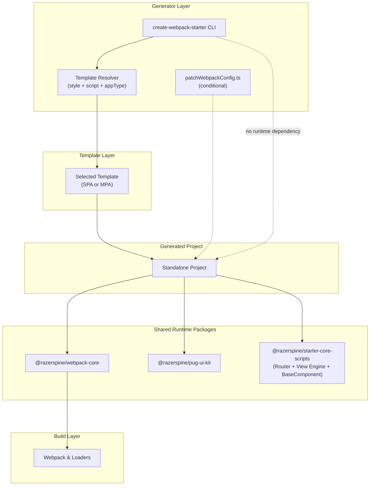

## Architecture

---

### System Architecture Diagram (Mermaid)



---

## Architectural Boundaries

- The CLI is a generator tool and is never used at runtime.
- Templates are copied into the generated project.
- Shared runtime packages are published to npm and versioned independently.
- The generated project is fully standalone.
- Runtime architecture lives inside published packages — not inside the CLI.

---

## Purpose

This repository is a **monorepo** that hosts:

- a public CLI (`create-webpack-starter`)
- official project templates
- shared runtime packages
- shared build configuration packages

The monorepo exists to ensure:

- consistent development experience
- shared tooling and conventions
- atomic changes across related packages
- synchronized architectural evolution

---

## Core Principles

### Strict separation of responsibilities

**CLI handles:**

- user interaction (prompts, flags)
- template selection
- file copying
- dependency installation

**Templates handle:**

- full project structure
- declared dependencies
- webpack configuration
- application source code

**Shared runtime packages handle:**

- Router
- Component lifecycle
- Reactive state
- View binding engine

Generated projects have **no runtime dependency** on the CLI.

---

## Runtime Architecture (SPA & MPA)

As of `starter-core-scripts@0.4.0`, runtime logic is centralized.

### SPA Runtime

SPA templates use:

- Router (Singleton pattern)
- BaseComponent abstraction
- mount() lifecycle orchestration
- Proxy-based reactive state
- Declarative DOM bindings

SPA lifecycle:

```
Route change
  ↓
destroy() previous component
  ↓
new Page(root)
  ↓
mount()
  ↓
render()
  ↓
initEventListeners()
  ↓
update()
  ↓
onInit()
```

The Router automatically detects and executes:

- `mount()`
- `render()`
- `destroy()`

Memory safety is handled via:

- cleanup registry
- Proxy disconnect
- delegated event binding

---

### MPA Runtime

MPA templates reuse the same reactive View Engine but without Router.

Includes:

- createStore()
- applyBindings()
- data-model
- data-bind
- data-show
- data-class
- data-for
- delegated events via data-click

MPA pages remain independent entry points.

---

## Application Types (SPA vs MPA)

Templates represent different architectural modes:

### MPA (Multi Page Application)

- Multiple entry points
- Multiple HTML pages
- SEO-friendly output
- Server-compatible structure

### SPA (Single Page Application)

- Single entry point
- Client-side routing
- Component lifecycle management
- App-like behavior

The CLI resolves:

- style (scss / less)
- script (js / ts)
- appType (spa / mpa)

The selected template defines the project structure.

The CLI does not modify architectural logic.

If necessary, `patchWebpackConfig.ts` may apply minimal,
explicit configuration adjustments after template copying.

Templates remain the source of truth.

---

## Package Types

- `create-webpack-starter` – published CLI
- `webpack-core` – shared webpack configuration (npm package)
- `pug-ui-kit` – UI assets & mixins (npm package)
- `starter-core-scripts` – Router + View Engine + BaseComponent (npm package)
- `templates/*` – source templates (not npm packages)

---

## Workspace Dependency Model

This repository uses **npm workspaces**, which affects how and where
`node_modules` directories are created.

### Important behavior

When running `npm install` from the repository root:

- npm builds a single dependency graph for all workspace packages
- dependencies are hoisted to the root `node_modules/` whenever possible
- individual workspace packages may not have their own `node_modules/` directory

This is expected and correct behavior.

### Practical consequences

- A workspace package can work correctly without a local `node_modules/`
- Node.js resolves dependencies by walking up the directory tree
- Local `node_modules/` presence is not guaranteed

Example:

```
root/
├─ node_modules/
│  └─ inquirer
├─ packages/
│  └─ create-webpack-starter/
│     └─ (no node_modules/)
```

Resolution still works correctly.

---

## Shared Runtime Packages

The monorepo contains shared runtime packages used by templates:

- `@razerspine/webpack-core`
- `@razerspine/pug-ui-kit`
- `@razerspine/starter-core-scripts`

These are published npm packages.

Templates declare them as normal semver dependencies
(e.g. `"^0.4.0"`), not as workspace dependencies.

This guarantees:

- Generated projects are fully standalone
- No workspace references leak into published templates
- CLI users always receive stable, published versions

---

## Templates and Dependency Installation

Directories under `templates/` are **not npm workspaces**.

npm does not install dependencies for templates automatically.

Template projects receive dependencies only when:

- the CLI copies the template into a target directory
- the CLI runs `npm install` inside the generated project

### Local template development

During local development, `node_modules/` and `dist/` may exist
inside template folders.

These directories:

- are ignored by git
- are ignored during template copying
- are never shipped to end users

This guarantees:

- clean generated projects
- predictable installs
- no leakage of development artifacts

---

## Dependency Strategy

Templates must never use:

- `workspace:*`
- `file:`
- local path references

Templates must always depend on published npm versions
of shared packages using semver ranges (e.g. `^0.4.0`).

The CLI is responsible only for copying templates
and running `npm install` in the target directory.іі
