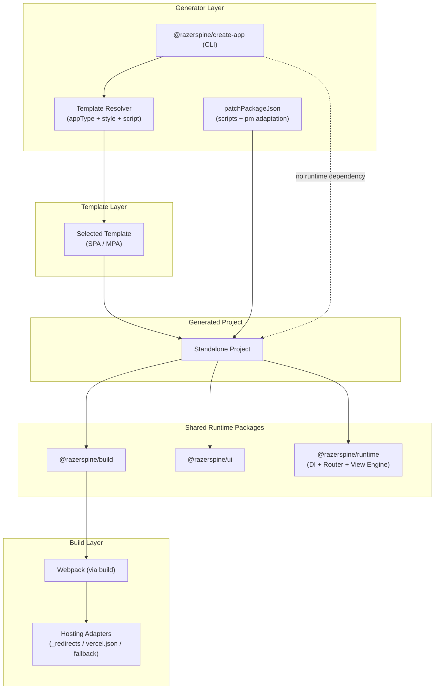

# Architecture

---

## System Architecture Diagram (Mermaid)



---

## Architectural Boundaries

- CLI is a **generator only** (never used at runtime)
- Templates are **copied**, not linked
- Runtime packages are **versioned independently**
- Generated project is **fully standalone**
- Runtime logic lives in **published packages**

---

## Purpose

This repository is a **monorepo for a frontend ecosystem**:

- CLI generator → `@razerspine/create-app`
- Build system → `@razerspine/build`
- Runtime engine → `@razerspine/runtime`
- UI layer → `@razerspine/ui`
- Internal templates

---

## Core Principles

### 1. Separation of Concerns

| Layer     | 	Responsibility |
|-----------|-----------------|
| CLI       | 	scaffolding    |
| Templates | 	structure      |
| Runtime   | 	app logic      |
| Build     | 	bundling       |
| UI        | 	presentation   |

### 2. Standalone Output

Generated projects:

- have **no dependency on CLI**
- use **published npm packages**
- are **production-ready immediately**

### 3. Explicit Architecture

No auto-detection magic:

- `appType` → SPA / MPA
- `style` → SCSS / Less
- `script` → TS / JS

---

## CLI Architecture (`@razerspine/create-app`)

### Responsibilities

- parse CLI args (`commander`)
- validate flags
- prompt missing data (`inquirer`)
- resolve template
- copy files
- patch `package.json`
- install dependencies

---

## New Feature: Package Manager Support

CLI supports:

```text
--pm npm | yarn | pnpm | bun
```

### Behavior

- updates `package.json` → `packageManager`
- rewrites scripts:
  - `npm run build` → `pnpm build`
  - `npm run dev` → `yarn dev`
- used in install step

---

## Template System

Templates are selected by:

- `appType`
- `style`
- `script`

Total combinations: **8 templates**

Templates are:

- internal to CLI
- copied into project
- never exposed directly

---

## Runtime Architecture (`@razerspine/runtime`)

### SPA Mode

Includes:

- DI container
- Router
- BaseComponent lifecycle
- Reactive state (Proxy)
- DOM bindings engine

#### Bootstrap

```ts
bootstrapApplication({
  providers: [
    provideRouter(routes)
  ]
});
```

#### Component Model

```ts
class Page extends BaseComponent {
    protected onInit() {}
}
```

#### Lifecycle

```text
render()
  ↓
bind events
  ↓
update()
  ↓
onInit()
```

#### Router Features

- navigation
- history
- guards
- async lifecycle

#### Guards

| Return  | 	Behavior |
|---------|-----------|
| true    | 	allow    |
| false   | 	block    |
| string  | 	redirect |
| Promise | 	async    |

### MPA Mode

Uses partial runtime:

- `createStore`
- `applyBindings`

No:

- Router
- DI

---

## Build System (`@razerspine/build`)

### Responsibilities

- webpack configuration
- loaders & plugins
- dev server
- production builds
- environment handling

### Config API

```ts
defineConfig({
  appType: 'spa',
  script: 'ts',
  style: 'scss',
  templates: {
    entry: 'src/app/app.pug'
  }
});
```

### Pug Dual Mode

| Mode    | 	Purpose        |
|---------|-----------------|
| render  | 	HTML output    |
| compile | 	SPA components |

### Stability Strategy

- no aggressive optimizations
- predictable output
- extensible config

---

## UI Layer (`@razerspine/ui`)

Provides:

- Pug mixins
- UI components
- shared styles

Used as:

```text
@use '@razerspine/ui'
```

---

## Application Types

### MPA

- multi-entry
- SEO-friendly
- static output

### SPA

- single entry
- client routing
- app-like behavior

---

## Hosting Support

Auto-generated configs:

| Platform             | File          |
|----------------------|---------------|
| Netlify / Cloudflare | `_redirects`  |
| Vercel               | `vercel.json` |
| GitHub Pages         | `404.html`    |

---

## Testing Strategy

### Layers

- Unit (utils, steps)
- Integration (installer, pipeline)
- E2E (CLI behavior)

### Tools

- Vitest
- real CLI execution
- temp directories

---

## Package Types

| Package                  | Purpose        |
|--------------------------|----------------|
| `@razerspine/create-app` | CLI            |
| `@razerspine/build`      | build system   |
| `@razerspine/runtime`    | runtime engine |
| `@razerspine/ui`         | UI kit         |

---

## Dependency Model

Templates depend on:


```json
{
  "@razerspine/build": "^1.x",
  "@razerspine/runtime": "^1.x",
  "@razerspine/ui": "^1.x"
}
```


Rules:

- no `workspace:*`
- no `file:`
- only published versions

---

## Monorepo Strategy

Uses npm workspaces:

- shared dependency graph
- hoisted `node_modules`
- atomic updates across packages

---

## Mental Model

Think of the system as:

```text
create-app → templates → build → runtime → UI
```

---

## Summary

This ecosystem provides:

- **CLI for scaffolding**
- **Build system for bundling**
- **Runtime for application logic**
- **UI layer for presentation**

All parts are:

- decoupled
- composable
- production-ready
