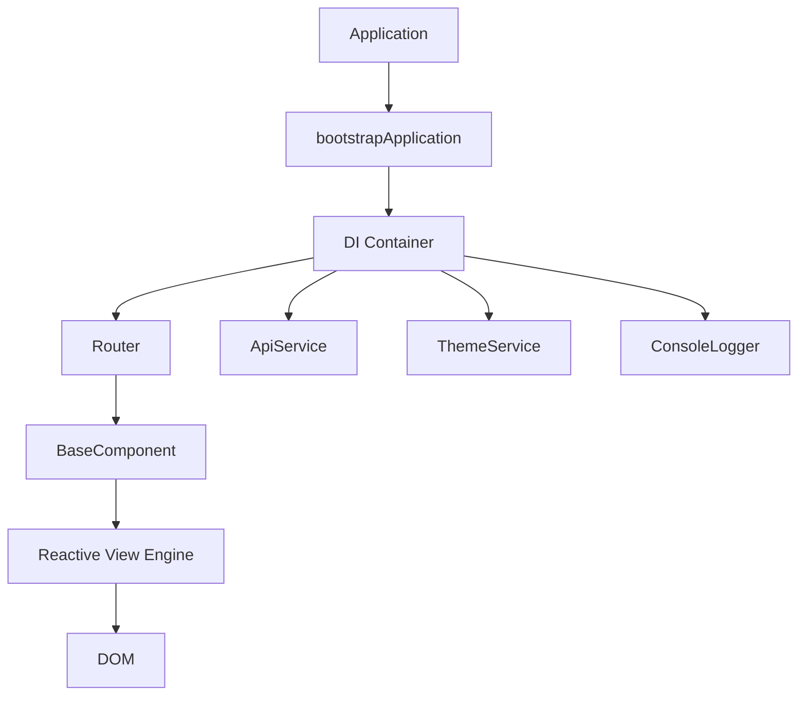

# @razerspine/starter-core-scripts

[](https://www.npmjs.com/package/@razerspine/starter-core-scripts)
[](./CHANGELOG.md)
[](./LICENSE)

Core frontend services and a lightweight **View Engine** used by the official webpack starter templates.

This package provides production-ready utilities for building modern **SPA / Hybrid applications** without heavy frameworks.

---

## Table of Contents

- [Features](#features)
- [Installation](#installation)
- [Quick Start](#quick-start)
- [Application Bootstrap](#application-bootstrap-v050)
- [Architecture](#architecture)
- [Dependency Injection](#dependency-injection)
- [Reactive View Engine](#reactive-view-engine)
- [Component Lifecycle](#component-lifecycle)
- [SPA Router](#spa-router)
- [Programmatic Navigation](#programmatic-navigation)
- [Supported Data Attributes](#supported-data-attributes)
- [ThemeService](#themeservice)
- [TranslationService](#translationservice)
- [ApiService](#apiservice)
- [ConsoleLogger](#consolelogger)
- [Exports](#exports)
- [Requirements](#requirements)
- [License](#license)

---

# Features

- **Reactive View Engine** — Lightweight DOM binding and state management
- **Dependency Injection** — Simple but strict DI container
- **SPA Router** — Client-side navigation with lifecycle management
- **Route Guards** — Protect routes or redirect dynamically
- **Theme Management** — Light/dark mode with persistence
- **Internationalization** — DOM-based i18n system
- **API Requests** — Structured Fetch wrapper
- **Logging** — Styled console utilities
- **Zero Dependencies**

---

# Installation

```bash
npm install @razerspine/starter-core-scripts
```

---

# Quick Start

Create a minimal SPA with Router and a single page.

```ts
import {
  bootstrapApplication,
  provideRouter
} from '@razerspine/starter-core-scripts';

import {HomePage} from './views/home';

bootstrapApplication({
  providers: [
    provideRouter([
      {path: '/', component: HomePage, title: 'Home'}
    ])
  ]
});
```

This will:

- initialize the **DI container**
- register the **Router**
- mount the **first page**

---

# Application Bootstrap (v0.5.0)

Applications are started using `bootstrapApplication()`.

This registers services in the DI container and starts the Router.

```ts
import {
  bootstrapApplication,
  provideRouter
} from '@razerspine/starter-core-scripts';

import {HomePage} from './views/home';

bootstrapApplication({
  providers: [
    provideRouter([
      {path: '/', component: HomePage, title: 'Home'}
    ])
  ]
});
```

### Why this architecture?

- Router instance becomes available via **DI**
- Services are **explicitly registered**
- Application startup becomes **deterministic and safe**

---

# Architecture



---

# Dependency Injection

The package includes a lightweight **strict-mode DI container**.

Services must be registered during bootstrap.

## Injecting a Service

```ts
import {inject, Router} from '@razerspine/starter-core-scripts';

export class HomePage {

  private router = inject(Router);

  goDashboard() {
    this.router.navigate('/dashboard');
  }

}
```

---

<details>
<summary><strong>Providing Services</strong></summary>

```ts
bootstrapApplication({
  providers: [
    {provide: ApiService},
    {provide: ConsoleLogger}
  ]
});
```

</details>

---

<details>
<summary><strong>Factory Providers</strong></summary>

```ts
bootstrapApplication({
  providers: [
    {
      provide: ApiService,
      useFactory: () => new ApiService('/api')
    }
  ]
});
```

</details>

---

### Strict DI Mode

The container **does NOT auto-instantiate services**.

If a service is injected but not registered:

```text
Service "MyService" is not registered in the DI container.
```

This prevents hidden dependencies and runtime surprises.

---

# Reactive View Engine

The View Engine allows building reactive UI components using **BaseComponent**.

State changes automatically update the DOM.

## BaseComponent

Extend `BaseComponent` to create reactive pages or components.

---

## Example

```ts
import {BaseComponent} from '@razerspine/starter-core-scripts';
import template from './home.pug';

interface HomeState {
  title: string;
  count: number;
}

export class HomePage extends BaseComponent<HomeState> {

  constructor(container: HTMLElement) {
    super(container, {
      title: 'SPA Template',
      count: 0
    });
  }

  protected render() {
    this.container.innerHTML = template();
  }

  protected onInit() {
    console.log('Component mounted');
  }

  increment() {
    this.setState({
      count: this.state.count + 1
    });
  }

}
```

---

# Component Lifecycle

Execution order:

```text
render()
↓
initEventListeners()
↓
update()
↓
onInit()
```

Lifecycle orchestration is handled by:

```text
mount()
```

Router automatically calls `mount()` for pages.

---

## Async Lifecycle (v0.5.0)

Components may now use **async lifecycle hooks**.

```ts
protected async onInit() {
  const users = await api.get('/users');
  this.setState({users});
}
```

Both lifecycle methods may return a Promise:

```ts
render(): void | Promise<void>
onInit(): void | Promise<void>
```

Router waits for full initialization before finishing navigation.

---

# SPA Router

Router handles:

- client-side navigation
- browser history
- component lifecycle
- route guards

---

## Route Configuration

```ts
import {Route} from '@razerspine/starter-core-scripts';

const routes: Route[] = [
  {
    path: '/',
    component: HomePage,
    title: 'Home'
  }
];
```

---

## Route Guards (v0.5.0)

Routes can define `canActivate` **guards**.

Guards run before navigation.

### Guard Result Types

```text
true     → allow navigation
false    → block navigation
string   → redirect
Promise  → async guard
```

---

### Example Guard

```ts
const authGuard = () => {
  const token = localStorage.getItem('token');

  if (!token) {
    return '/login';
  }

  return true;
};
```

---

### Using Guards

```ts
const routes: Route[] = [
  {
    path: '/dashboard',
    component: DashboardPage,
    canActivate: [authGuard]
  }
];
```

---

# Programmatic Navigation

Use `inject(Router)`.

```ts
import {inject, Router} from '@razerspine/starter-core-scripts';

export class LoginPage {

  private router = inject(Router);

  onLoginSuccess() {
    this.router.navigate('/dashboard');
  }

}
```

---

# Supported Data Attributes

| Attribute    | Description                                   | Example                             |
|--------------|-----------------------------------------------|-------------------------------------|
| `data-bind`  | Updates `textContent`                         | `span(data-bind="user.name")`       |
| `data-model` | Two-way binding (state ↔ input.value)         | `input(data-model="email")`         |
| `data-click` | Event delegation for clicks                   | `button(data-click="submit")`       |
| `data-show`  | Toggles visibility (supports !)               | `div(data-show="!isError")`         |
| `data-class` | Toggles CSS classes                           | `div(data-class="active:isActive")` |
| `data-for`   | Renders lists (supports nesting and `_index`) | `ul(data-for="item:items")`         |

---

# ThemeService

Manages light/dark theme state with optional localStorage persistence.

```ts
const theme = new ThemeService();
theme.init();
theme.setTheme('dark');
```

---

# TranslationService

Provides DOM-based i18n support using `data-i18n` attributes.

```ts
const locales = {
  en: {greeting: {hello: 'Hello'}},
  uk: {greeting: {hello: 'Привіт'}}
};

const i18n = new TranslationService(locales);
i18n.init();
```

---

# ApiService

Lightweight Fetch wrapper with:

- Query params support
- Timeout via AbortController
- Automatic JSON handling
- Centralized error handling
- Optional Bearer token

```ts
const api = new ApiService('https://api.example.com');
api.setToken('jwt-token');

try {
  const users = await api.get('/users', {
    params: {role: 'admin'},
    timeout: 5000
  });
} catch (err) {
  if (err instanceof ApiError) {
    console.error(err.status, err.data);
  }
}
```

---

# ConsoleLogger

Styled console logging utility.

```ts
const logger = new ConsoleLogger();
logger.success('Application initialized');
```

---

# Exports

```ts
import {
  BaseComponent,
  Router,
  bootstrapApplication,
  provideRouter,
  inject,
  ApiService,
  ApiError,
  ThemeService,
  TranslationService,
  ConsoleLogger
} from '@razerspine/starter-core-scripts';
```

---

# Requirements

- Modern browsers
- ES6+
- Proxy support
- WeakMap support
- Fetch API

Recommended:

```text
TypeScript >= 5
```

---

# License

This project is licensed under the ISC License.
